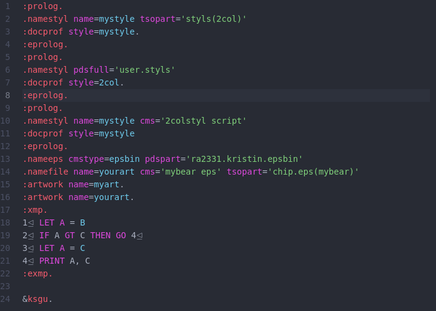

**NOTICE: This project is in [Emeritus status](https://tac.openmainframeproject.org/process/lifecycle.html#emeritus-stage) and no longer maintained**

# language-zvm-gml package

Atom editor package that adds language syntax highlighting for z/VM SCRIPT files, containing Script and/or BookMaster tags

> The package currently uses [TextMate Grammar](https://macromates.com/manual/en/language_grammars) for Syntax Highlighting and plans on shifting to [Tree-Sitter Grammar](http://tree-sitter.github.io/tree-sitter/) in near future

### Sample Highlighting 1

### References:
1. [ATOM grammars](https://flight-manual.atom.io/hacking-atom/sections/creating-a-grammar)
2. [Generating ATOM snippets](https://flight-manual.atom.io/using-atom/sections/snippets)
3. [TextMate 1.0 Mannual](https://macromates.com/manual/en/language_grammars)
#

* See the NOTICE file for copyrights.
* See the LICENSE file for license information.
